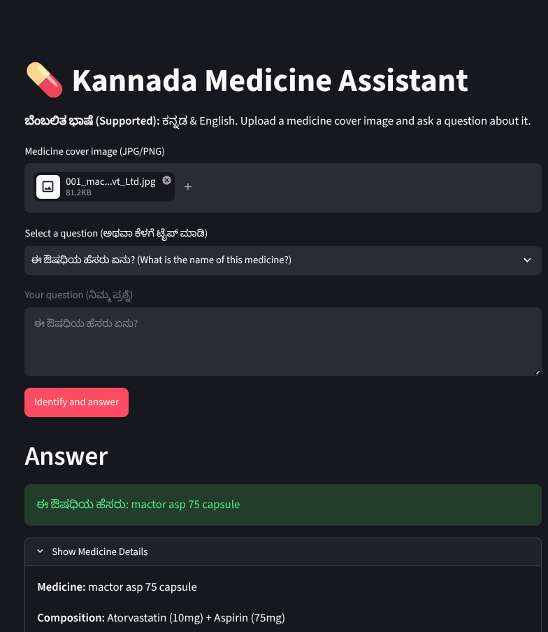

# Empowering-Decision-Through-Pill-Identification

Empowering-Decision-Through-Pill-Identification is a medicine-cover identification prototype for Kannada and English users. A user uploads a photograph of a medicine strip, box, or bottle and asks a question. The application reads the packaging, searches a local medicine catalogue, and answers from the matched catalogue record.

The project is intended for demonstrations, education, and evaluation. It does not replace a doctor or pharmacist and must not be used to choose a medicine, change treatment, or decide a dose.

## Live application

Open the deployed Streamlit application:

**[Empowering-Decision-Through-Pill-Identification](https://kannada-medicine-assistant-live-fm3j9tvsrcjczr5deqqr6n.streamlit.app/)**

The application may ask you to sign in with Streamlit before opening the interface.

Click the screenshot to open the live application:

[](https://kannada-medicine-assistant-live-fm3j9tvsrcjczr5deqqr6n.streamlit.app/)

## What the application accepts

The Streamlit page accepts two inputs.

### 1. Medicine-cover image

Supported formats:

- JPG and JPEG
- PNG
- WEBP
- BMP

A clear image gives the best result. The brand name, strength, composition, and manufacturer should be visible. Blurred photographs, glare, cropped labels, handwritten text, and unfamiliar brands can produce an uncertain result.

### 2. Question

The question may be written in Kannada or English. The page includes common Kannada questions, and users can also type their own.

Examples:

```text
What is this medicine used for?
What is its composition?
Who manufactures this medicine?
ಈ ಔಷಧಿಯನ್ನು ಯಾವುದಕ್ಕಾಗಿ ಬಳಸುತ್ತಾರೆ?
ಈ ಔಷಧಿಯ ಸಂಯೋಜನೆ ಏನು?
ಇದರ ಸಾಮಾನ್ಯ ಅಡ್ಡ ಪರಿಣಾಮಗಳು ಯಾವುವು?
```

## What the application returns

When identification succeeds, the page shows:

- medicine name
- composition
- manufacturer
- catalogue match score
- an answer in the same language as the question
- OCR text and technical details in an expandable section

If the evidence is weak or two catalogue entries are too similar, the application reports that the medicine could not be identified confidently. It does not generate medicine information for an uncertain match.

The catalogue does not contain dosage instructions. A dosage question therefore returns a message asking the user to follow a doctor or pharmacist's instructions.

## Processing flow

```text
Uploaded image
    -> EasyOCR text extraction
    -> line grouping and noise filtering
    -> medicine catalogue ranking
    -> confidence and ambiguity checks
    -> matched catalogue record
    -> Kannada or English answer
```

### 1. Save the upload temporarily

`streamlit_app.py` writes the uploaded image to a temporary directory. Processing output is also written there. Streamlit removes the directory after the request finishes, so uploaded images are not kept as application data.

### 2. Read packaging text

`extract_text.py` loads EasyOCR in CPU mode. `ocr_csv_classifier.py` sends the image to OCR and keeps recognized regions with a minimum confidence of 0.25.

OCR boxes on the same visual line are joined. This helps when a name and strength are split into separate boxes, for example `Dolo` and `650`.

### 3. Remove packaging noise

The classifier ignores text that is not useful for medicine identity, including:

- batch and expiry information
- manufacturing dates
- MRP text
- storage instructions
- generic words such as `tablet`, `capsule`, and `dosage`

The remaining lines are treated as possible brand, composition, or manufacturer evidence.

### 4. Rank catalogue records

`ocr_csv_classifier.py` compares OCR text with `database/runtime/medicine_details_verified.csv` using RapidFuzz.

The final score is based on:

- brand evidence: 60%
- composition evidence: 30%
- manufacturer evidence: 10%

The matcher penalizes conflicting numbers and formulation labels. This reduces errors such as accepting a `500 mg` product when the image shows `650 mg`, or confusing standard and sustained-release variants.

A candidate is accepted only when it passes the configured score and margin rules. Otherwise, the result is marked uncertain.

### 5. Resolve the confirmed medicine

`main_chatbot.py` passes the accepted medicine name to `kannada_rag.py`. The RAG module resolves that name against the saved catalogue index and retrieves the complete row for the confirmed medicine.

The retrieved evidence can include:

- medicine name
- composition
- manufacturer
- recorded uses
- recorded possible side effects
- review percentages present in the source dataset

### 6. Prepare the answer

For common questions, `kannada_rag.py` can prepare a deterministic answer directly from the catalogue row.

If an OpenRouter key is configured, `openrouter_llm.py` sends only the question and the matched catalogue row to OpenRouter. The uploaded image and other catalogue rows are not sent. The generation prompt requires an answer in the question's language and prohibits unsupported dosage, diagnosis, interaction, contraindication, or treatment claims.

If OpenRouter fails after identification, the application can return the local catalogue-based answer instead.

## Example

Input:

```text
Image: a clear Dolo 650 strip photograph
Question: ಈ ಔಷಧಿಯನ್ನು ಯಾವುದಕ್ಕಾಗಿ ಬಳಸುತ್ತಾರೆ?
```

Typical successful output:

```text
Medicine: Dolo 650 Tablet
Composition: Paracetamol 650 mg
Manufacturer: [value from the matched catalogue row]
Answer: Kannada explanation based on the recorded Uses field
```

The exact output depends on the text visible in the image and the contents of the matched catalogue record.

## Repository structure

```text
backend/
  main.py                 FastAPI entry point
  api/routes.py           HTTP routes for the alternate web interface
  core/config.py          Runtime paths and upload limits
  services/               Wrappers around identification and answer generation

database/runtime/
  medicine_details_verified.csv       Medicine catalogue used by the app
  medicine_rag_sbert_index.joblib      Bundled semantic-index artifact

frontend/                  HTML, JavaScript, and CSS for the FastAPI interface
extract_text.py            EasyOCR loading and image text extraction
ocr_csv_classifier.py      OCR grouping, classification, ranking, and acceptance rules
kannada_rag.py             Catalogue lookup, language/intent detection, and fallback answers
openrouter_llm.py          OpenRouter request and grounded-answer validation
main_chatbot.py            End-to-end pipeline orchestration
streamlit_app.py           Streamlit Community Cloud entry point
requirements.txt           Streamlit runtime dependencies
Dockerfile                 Container build for the Streamlit application
```

The active configuration requests `medicine_rag_tfidf_index.joblib`. If that file is not present when a request starts, `main_chatbot.py` builds it from the runtime CSV before continuing. The bundled SBERT index is retained as a project artifact but is not selected by the current Streamlit configuration.

The `streamlit` branch is a deployment branch. Training datasets, YOLO experiments, evaluation reports, and development tests are intentionally excluded from it.

## Run locally

Python 3.11 is recommended.

```bash
git clone --branch streamlit --single-branch https://github.com/harshkamble14062002/Empowering-Decision-Through-Pill-Identification-.git pill-assistant
cd pill-assistant
python3.11 -m venv .venv
source .venv/bin/activate
pip install -r requirements.txt
```

Create a local `.env` file:

```env
OPENROUTER_API_KEY=your_openrouter_key
OPENROUTER_MODEL=openrouter/free
```

Do not commit `.env` or a real API key.

Start Streamlit:

```bash
streamlit run streamlit_app.py
```

Open the URL printed by Streamlit, normally `http://localhost:8501`.

The first OCR run may be slower because EasyOCR downloads and initializes its recognition models.

## Run with Docker

The Docker image uses Python 3.11, CPU-only OCR, a non-root user, and Streamlit's default port `8501`. EasyOCR's English recognition files are downloaded during the image build, so the running container does not need to download them on its first request.

Build the image from the repository root:

```bash
docker build -t empowering-pill-identification:latest .
```

Run it with an OpenRouter key from the shell environment:

```bash
docker run --rm \
  -p 8501:8501 \
  -e OPENROUTER_API_KEY="$OPENROUTER_API_KEY" \
  -e OPENROUTER_MODEL="openrouter/free" \
  empowering-pill-identification:latest
```

Open `http://localhost:8501`.

To load values from a local `.env` file instead:

```bash
docker run --rm --env-file .env -p 8501:8501 empowering-pill-identification:latest
```

The image includes the catalogue and bundled runtime index. The active TF-IDF index is generated from the catalogue when it is absent. Do not copy `.env` into the image; `.dockerignore` excludes it.

## Deploy on Streamlit Community Cloud

1. Push this branch to GitHub.
2. Open [share.streamlit.io](https://share.streamlit.io/).
3. Create a new app from this repository.
4. Select the `streamlit` branch.
5. Set the main file path to `streamlit_app.py`.
6. Open the app's **Settings > Secrets** page.
7. Add the OpenRouter key:

```toml
OPENROUTER_API_KEY = "your_openrouter_key"
```

8. Save the secret and reboot the app if Streamlit does not restart automatically.

The key should be stored in Streamlit Secrets. It must not be added to the repository, README, or application URL.

## Common deployment errors

### `OPENROUTER_API_KEY is not configured`

Add `OPENROUTER_API_KEY` under Streamlit **Settings > Secrets**, save it, and reboot the app.

### `No module named 'sklearn'`

The application uses `sklearn.metrics.pairwise.cosine_similarity`. Confirm that `scikit-learn` is present in `requirements.txt`, then reboot the app.

### PyTorch wheel or Python ABI error

This occurs when an exact PyTorch version has no wheel for Streamlit's Python version. The deployment branch allows Streamlit to resolve a compatible CPU build rather than requesting one unavailable ABI build.

### Saved index not found

`RAG_INDEX_FILE` in `backend/core/config.py` must point to a file that exists under `database/runtime/`. Both the path and filename must match exactly, including capitalization.

### Slow first request

EasyOCR model initialization is expensive. A cold Streamlit instance or the first request after reboot can take longer than later requests.

## Data and evaluation notes

The catalogue contains 7,975 medicine records with names, compositions, manufacturers, uses, possible side effects, and review fields. These fields come from the project dataset and have not been independently medically verified.

A previous internal evaluation used 50 reviewed images:

- 36 correct identifications
- 0 accepted wrong identifications
- 14 uncertain identifications

This corresponds to 72% exact identification on that small development sample. It is not an independent clinical benchmark. More testing with new images and Kannada-language review is required before treating the application as production-ready.

## Privacy and safety

- Uploaded images are processed in a temporary directory.
- Only the question and the confirmed catalogue row are sent to OpenRouter.
- Uncertain medicine matches stop before answer generation.
- The application does not provide or infer dosage instructions.
- Dataset content may be incomplete or outdated.
- Users should verify medicine information with a doctor or pharmacist.

## Team

- Parshuram G P
- Parvati M B
- Shreyas V M
- Harsha Ravindra Kamble

Project guide: Dr. S. Saranya Rubini, PES University
